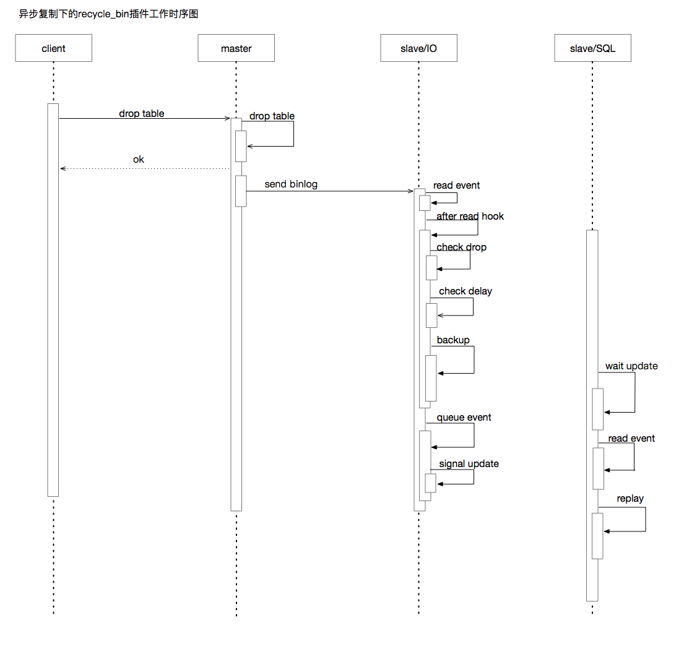
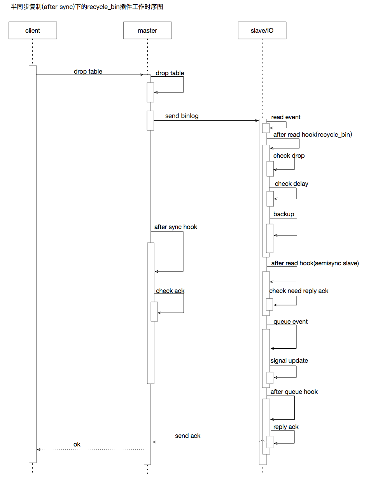

# MySQL防误删插件Recycle-Bin

## 1.  Recycle-Bin简介

recycle_bin是一款MySQL插件，可以在不修改任何MySQL代码的情况下，自动备份MySQL中被Drop的数据库/表，在出现人为误操作删表时，可以快速的进行恢复。
实现灵感来源于Oracle flashback的功能，但是从功能完整性上来讲，还有较大的差距,目前仍在完善中。

## 2. Recycle-Bin工作原理
原理非常简单，没什么技术含量。recycle_bin并不直接作用于master实例，而是工作在复制环境中的slave实例上，当通过程序/脚本或者人为在master实例上进行drop操作时，slave实例可以拦截drop操作，先进行数据备份，再进行删除操作。当备份文件超过保存时间后，recycle_bin会自动清除这些备份数据。完整的工作流程可以参照下图





长久以来，MySQL DBA通过一系列的方法限制非超级用户的Drop权限来避免数据表的误删除操作。但是权限收敛并不意味着不需要去进行Drop操作，一旦实施Drop操作，无论是手动还是通过程序自动化进行，就都有可能出现误操作。更不要说一些没有专人维护的数据库实例，RD直接操作数据库更容易引起误删的问题。
即便我们已经有了非常完善的备份策略，可以通过全量+增量的方式恢复删除的数据，但是时间成本太高；还有系统级别的数据恢复方案等等，也不能完全保证数据可以恢复到完全一致的状态，可能出现一次核心业务的表误删除操作，SLA就无法达标。
然之后我们又想通过复制延迟来解决这个问题，在master实例上执行了drop操作之后，slave在设定时间内不会应用日志，可以通过slave实例找到相对应的数据，但这个方案会影响数据库切换逻辑，导致切换时间倍增，并且固定的复制延迟意味着某些查询操作不能路由到从实例上，对于监控上来讲也是一个不可避免的问题。

## 3. Recycle_bin安装部署说明

### 3.1  下载编译好的lib文件
```bash
#下载页面
https://github.com/sunashe/MySQL-Plugin-Recycle-Bin/releases
```

### 3.2 源码编译
可以通过下载源代码编译，源码编译依赖MySQL源代码，推荐使用5.7.18以上的版本进行编译。
```sh
git clone git@github.com:sunashe/MySQL-Plugin-Recycle-Bin.git
cp -r MySQL-Plugin-Recycle-Bin  mysql_source_dir/plugin/
cd mysql_source_dir
cmake . -DBUILD_CONFIG=mysql_release -DDOWNLOAD_BOOST=1  -DWITH_BOOST=/usr/local/boost/
cd plugin/MySQL-Plugin-Recycle-Bin
make
```

### 3.3 安装插件
```bash
#拷贝下载或者编译得到的recycle_bin.so到MySQL中配置的plugin_dir下。并且更改所属用户。
mysql> install plugin recycle_bin soname 'recycle_bin.so';
Query OK, 0 rows affected (0.02 sec)
```
查看MySQL错误日志，如果出现如下内容，则证明安装成功
```bash
2019-02-20T19:52:27.326951+08:00 22 [Note] Install Plugin 'recycle_bin' successfully.
```

### 3.4 卸载插件
和卸载其它插件一样，命令如下：
```bash
mysql> uninstall plugin recycle_bin;
Query OK, 0 rows affected (0.02 sec)
```
## 4. Recycle_Bin 参数/状态说明
插件引入了一些新的参数和状态信息，可以在MySQL中通过`show`命令查看。
### 4.1 增加的variables
- recycle_bin_enabled
全局控制操作，ON表示开启recycle_bin的功能，在recycle_bin准备就绪后，会自动备份被Drop的表

- recycle_bin_database_name
指定回收站库名，默认为recycle_bin_dba

- recycle_bin_expire_seconds
备份表的过期时间，或者较保留时间，默认为1800s

- recycle_bin_check_sql_delay_period
备份操作时，需要等待所有相关的dml语句回放完成，recycle_bin_check_sql_delay_period用于
控制判断周期。默认为10us.

### 4.2 增加的status

- Recycle_bin_status
recycle_bin的工作状态，recycle_bin_enabled只是一个参数控制，而Recycle_bin_status表示已经符合了条件
，正式开始工作。一般只有在接收到master的FD event后才会正常工作。所以最好在安装插件后，在master上执行一次flush logs操作
或者重启复制IO线程。


## 5. 使用说明和限制

### 5.1 使用说明
- 支持异步或者半同步复制，可以和半同步复制插件一起工作在slave实例上。 对于异步复制来讲，不会影响master实例的性能，对于半同步复制来讲，会有5%左右的性能损失。
- 可以通过手动drop table的方式清除recycle_bin_dba下的备份表。
- 数据备份的自动清除会在业务无写入时进行，也可以通过手动清除。


### 5.2 使用限制
- 复制集群需要开启GTID模式，即MySQL参数`gtid_mode=on`。
- 只能工作在复制集群的slave实例中。
- 首次加载插件，需要在master上执行`flush logs`操作，或者等待binlog日志的自动轮换也可以。
- 由于备份表的表名格式为原库名_原表名_时间flag_unix时间戳(us)，所以库名+表名最长不能超过（64-16-7）,否则无法进行备份。

### 5.3 数据恢复说明
当真的出现表/库被误删除时，可以通过如下方式进行数据恢复。
- 从slave中将相关库/表数据导出，导入到master中
- 做主从切换，新主上直接rename即可。

### 5.4 使用示例
slave查看当前回收站状态
```bash
mysql> show global status like '%recycle%';
+--------------------+-------+
| Variable_name      | Value |
+--------------------+-------+
| Recycle_bin_status | ON    |
+--------------------+-------+
```
master上新建测试库表，插入数据
```bash
mysql> use sunashe;
Database changed
mysql> create table t1(id int not null auto_increment primary key,name varchar(10))
    -> ;
Query OK, 0 rows affected (0.02 sec)

mysql> insert into t1(name) values('aaa');
Query OK, 1 row affected (0.00 sec)

mysql> insert into t1(name) values('aaa');
Query OK, 1 row affected (0.00 sec)

mysql> insert into t1(name) values('aaa');
Query OK, 1 row affected (0.00 sec)

mysql> select * from t1;
+----+------+
| id | name |
+----+------+
|  1 | aaa  |
|  2 | aaa  |
|  3 | aaa  |
+----+------+
3 rows in set (0.00 sec)
```
slave上查看同步的数据
```bash
mysql> use sunashe;
Reading table information for completion of table and column names
You can turn off this feature to get a quicker startup with -A

Database changed
mysql> show tables;
+-------------------+
| Tables_in_sunashe |
+-------------------+
| t1                |
+-------------------+
1 row in set (0.01 sec)

mysql> select * from t1;
+----+------+
| id | name |
+----+------+
|  1 | aaa  |
|  2 | aaa  |
|  3 | aaa  |
+----+------+
3 rows in set (0.00 sec)
```

master上执行drop table操作
```bash
mysql> drop table t1;
Query OK, 0 rows affected (0.00 sec)
mysql> show tables;
Empty set (0.00 sec)

```
此时slave中sunashe库下的t1表也被删除了，但是存放在了回收站库中。
```bash
mysql> show tables;
Empty set (0.00 sec)

mysql> show tables in recycle_bin_dba;
+-------------------------------------+
| Tables_in_recycle_bin_dba           |
+-------------------------------------+
| db1_t1_ashesun_1550664699603202     |
| sunashe_t1_ashesun_1550664941582282 |
+-------------------------------------+

//错误日志
2019-02-20T20:15:41.581959+08:00 23 [Note] Master drop table sunashe.t1
2019-02-20T20:15:41.610112+08:00 23 [Note] Backup table sunashe.t1 successfully.
2 rows in set (0.00 sec)

```
表名格式为原库名_原表名_时间flag_unix时间戳(us)，查询备份数据正确性
```bash
mysql> select * from recycle_bin_dba.sunashe_t1_ashesun_1550664941582282;
+----+------+
| id | name |
+----+------+
|  1 | aaa  |
|  2 | aaa  |
|  3 | aaa  |
+----+------+
3 rows in set (0.01 sec)
```
备份数据过期后，在业务低峰期时(收到心跳event),自动清除。关联参数recycle_bin_expire_seconds.
```bash
mysql> set global recycle_bin_expire_seconds=10;
Query OK, 0 rows affected (0.01 sec)

mysql> show tables in recycle_bin_dba;
+-------------------------------------+
| Tables_in_recycle_bin_dba           |
+-------------------------------------+
| db1_t1_ashesun_1550664699603202     |
| sunashe_t1_ashesun_1550664941582282 |
+-------------------------------------+
2 rows in set (0.00 sec)

mysql> show tables in recycle_bin_dba;
Empty set (0.00 sec)

```
查看复制环境是否正常运行
```bash
mysql> show slave status\G
*************************** 1. row ***************************
               Slave_IO_State: Waiting for master to send event
                  Master_Host: 10.211.55.32
                  Master_User: ashe
                  Master_Port: 13307
                Connect_Retry: 60
              Master_Log_File: mysql-bin.000003
          Read_Master_Log_Pos: 3080
               Relay_Log_File: mysql-relay-bin-master_13307.000004
                Relay_Log_Pos: 3293
        Relay_Master_Log_File: mysql-bin.000003
             Slave_IO_Running: Yes
            Slave_SQL_Running: Yes
              Replicate_Do_DB:
          Replicate_Ignore_DB:
           Replicate_Do_Table:
       Replicate_Ignore_Table: mysql.ibbackup_binlog_marker
      Replicate_Wild_Do_Table:
  Replicate_Wild_Ignore_Table: mysql.backup_%
                   Last_Errno: 0
                   Last_Error:
                 Skip_Counter: 0
          Exec_Master_Log_Pos: 3080
              Relay_Log_Space: 3600
              Until_Condition: None
               Until_Log_File:
                Until_Log_Pos: 0
           Master_SSL_Allowed: No
           Master_SSL_CA_File:
           Master_SSL_CA_Path:
              Master_SSL_Cert:
            Master_SSL_Cipher:
               Master_SSL_Key:
        Seconds_Behind_Master: 0
Master_SSL_Verify_Server_Cert: No
                Last_IO_Errno: 0
                Last_IO_Error:
               Last_SQL_Errno: 0
               Last_SQL_Error:
  Replicate_Ignore_Server_Ids:
             Master_Server_Id: 12713307
                  Master_UUID: cdfe45e6-c227-11e8-abf5-001c42bf9720
             Master_Info_File: mysql.slave_master_info
                    SQL_Delay: 0
          SQL_Remaining_Delay: NULL
      Slave_SQL_Running_State: Slave has read all relay log; waiting for more updates
           Master_Retry_Count: 86400
                  Master_Bind:
      Last_IO_Error_Timestamp:
     Last_SQL_Error_Timestamp:
               Master_SSL_Crl:
           Master_SSL_Crlpath:
           Retrieved_Gtid_Set: cdfe45e6-c227-11e8-abf5-001c42bf9720:708-1419
            Executed_Gtid_Set: cdfe45e6-c227-11e8-abf5-001c42bf9720:1-1419
                Auto_Position: 1
         Replicate_Rewrite_DB:
                 Channel_Name: master_13307
           Master_TLS_Version:
1 row in set (0.01 sec)
```
recycle_bin的备份清除等操作不会记录任何binlog信息，保证和master的GTID一致。